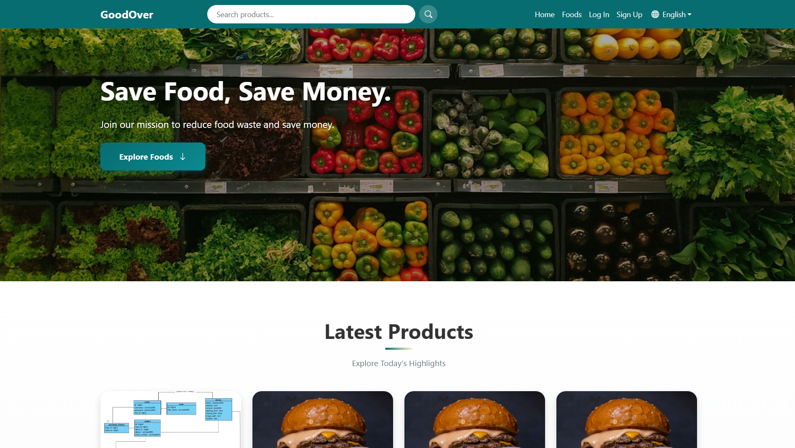
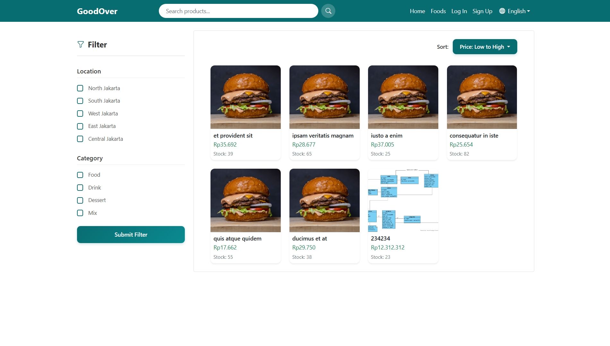
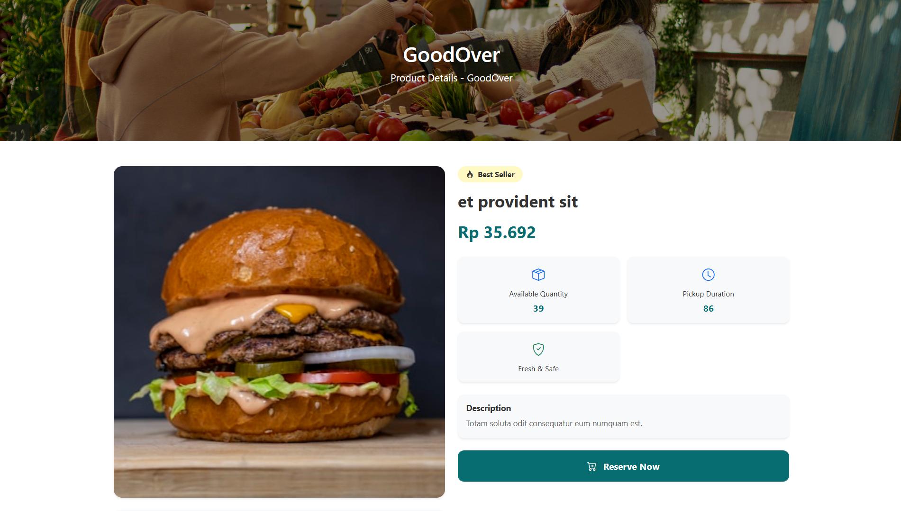
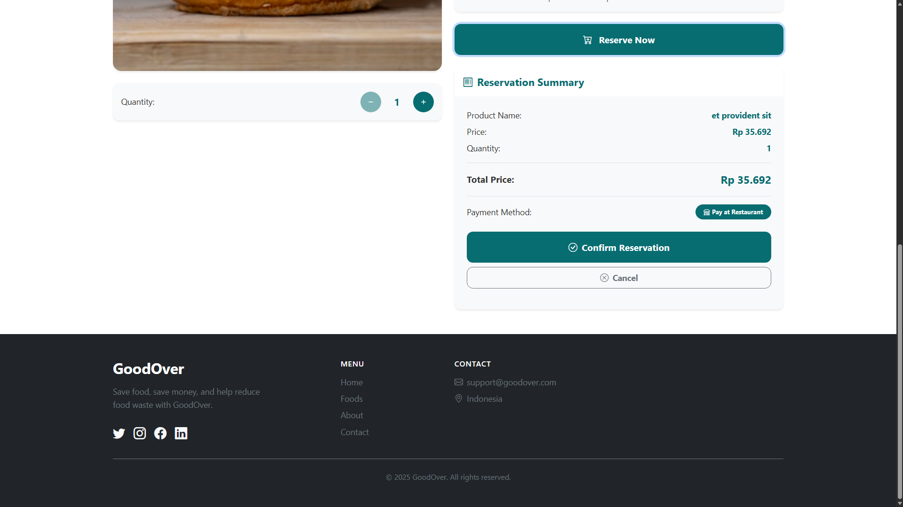
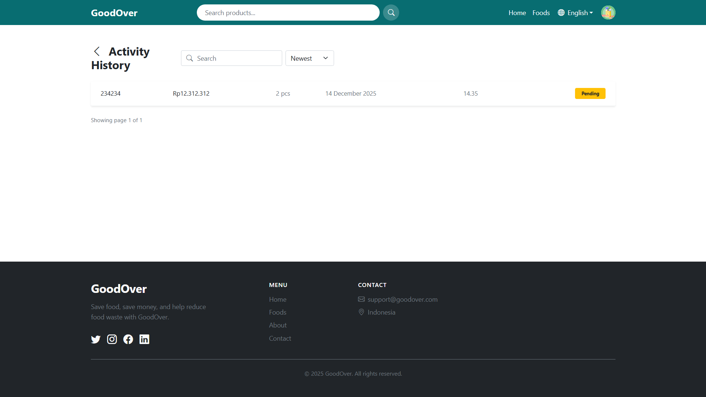
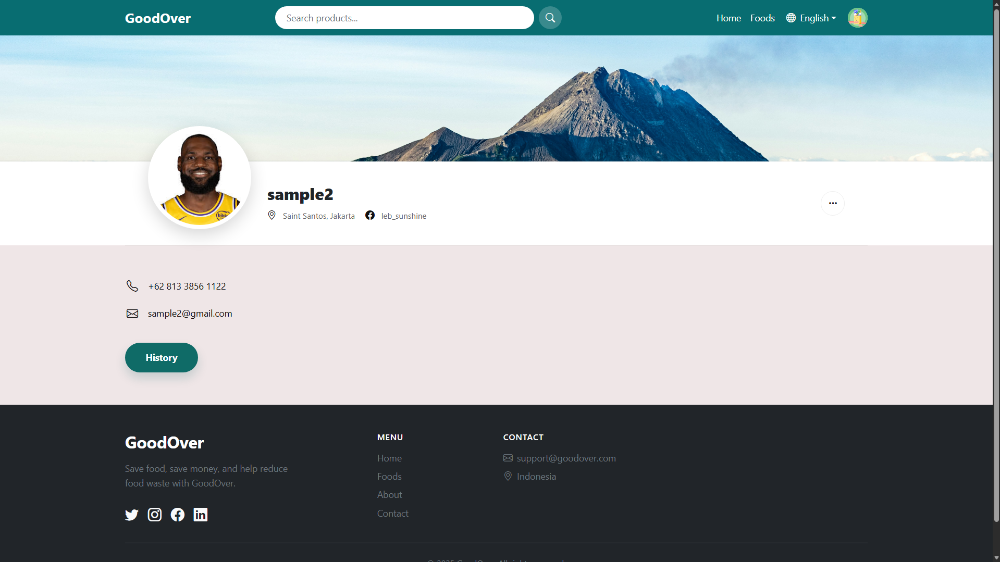
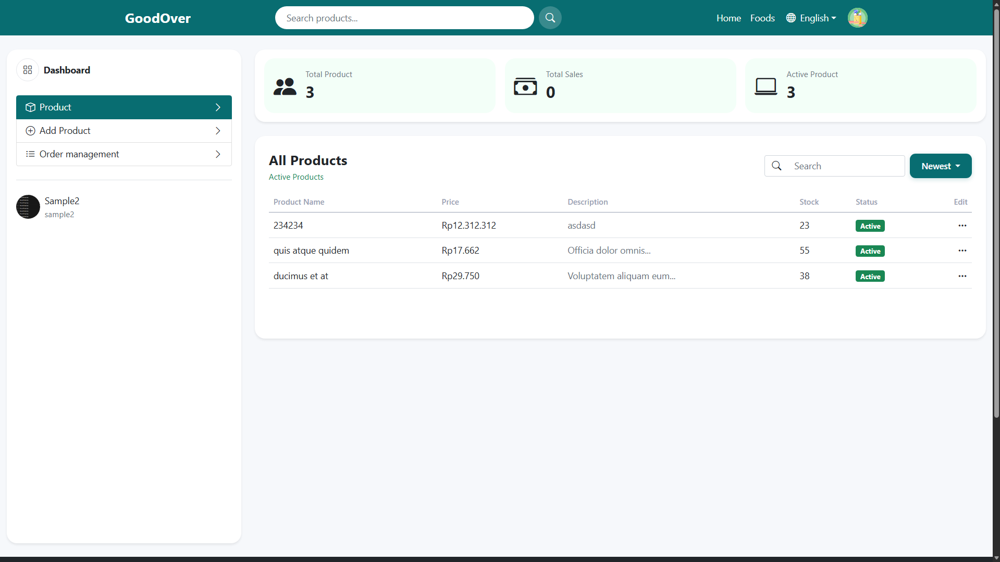

# GoodOver

A web-based platform designed to reduce food waste and help users save money by connecting buyers with surplus food from restaurants and stores. GoodOver enables sellers to list their excess inventory at discounted prices, while buyers can easily browse, reserve, and purchase food items before they go to waste.

## Overview

### The Problem

Food waste is a significant global issue, with millions of tons of food discarded daily while many people struggle with food insecurity. Restaurants and food establishments often have surplus inventory that goes unsold, resulting in financial losses and environmental impact.

### The Solution

GoodOver provides a marketplace where sellers can list their excess food inventory at reduced prices, and buyers can discover and reserve these items. The platform facilitates a win-win scenario: sellers minimize losses by selling surplus food, while buyers access quality food at affordable prices, all while contributing to waste reduction.

## Key Features

### For Buyers

-   **Product Discovery**: Browse available food items with advanced filtering by location and category
-   **Product Details**: View comprehensive product information including price, quantity, description, and pickup duration
-   **Reservation System**: Preview reservation summary before confirming, ensuring transparency in the ordering process
-   **Order Management**: Track order history with detailed information including order status, date, and time
-   **Single Active Order**: System enforces one active order per user to maintain order management efficiency

### For Sellers

-   **Product Management**: Create, update, and manage product listings with images, pricing, and inventory
-   **Dashboard**: Monitor product performance and sales statistics
-   **Store Management**: Manage store information and settings

### Core Functionality

-   **Multi-language Support**: English and Bahasa Indonesia localization
-   **Responsive Design**: Fully optimized for desktop, tablet, and mobile devices
-   **Role-based Access**: Separate interfaces for buyers and sellers using Spatie Laravel Permission
-   **Order Tracking**: Real-time order status updates (Pending, Finished, Cancelled)
-   **Payment Method**: Pay at Restaurant - default payment method for all orders

## Application Flow

### User Registration & Authentication

1. Users register with email and password
2. Users can upgrade to seller role by registering a store
3. Authentication required for order placement and profile access

### Product Browsing

1. Users browse products on homepage or product listing page
2. Apply filters by location and category
3. Sort products by price (ascending/descending)
4. Search products by name or description

### Reservation Process

1. User selects a product and views product details
2. User selects desired quantity (validated against available stock)
3. User clicks "Reserve Now" to view reservation summary
4. System displays preview with product name, price, quantity, total price, and payment method
5. User reviews summary and clicks "Confirm Reservation"
6. System validates:
    - User authentication
    - Product availability and active status
    - Quantity does not exceed stock
    - User has no active orders (status not finished/cancelled)
7. System creates order with auto-generated order number
8. System creates order items with product details
9. User receives confirmation with order number

### Order Management

-   Users can view order history in their profile
-   Each order displays product information, price, quantity, date, time, and status
-   Order status can be: Pending, Finished, or Cancelled
-   Users must complete or cancel current order before placing new orders

## Tech Stack

### Frontend

-   **Blade Templates**: Server-side templating engine for dynamic content rendering
-   **Bootstrap 5**: Responsive CSS framework for UI components and layout
-   **Bootstrap Icons**: Icon library for consistent visual elements
-   **Vanilla JavaScript**: Client-side interactivity and AJAX requests
-   **Vite**: Modern build tool for asset compilation

### Backend

-   **Laravel 12**: PHP web application framework
-   **PHP 8.2**: Server-side programming language
-   **Eloquent ORM**: Database abstraction and model management
-   **Spatie Laravel Permission**: Role and permission management system

### Database

-   **MySQL/PostgreSQL**: Relational database management system
-   **Database Migrations**: Version-controlled schema management

### Tools & Libraries

-   **Axios**: HTTP client for AJAX requests
-   **Faker**: Data generation for testing and seeding

## Database Overview

### Core Tables

**users**

-   Stores user account information (username, email, password)
-   Supports role-based access (buyer/seller)

**stores**

-   Contains store information (name, address, contact, location, opening/closing hours)
-   Linked to users through user_id for seller accounts

**products**

-   Product listings with details (name, price, description, image, status, quantity)
-   Associated with stores and categories
-   Tracks available inventory (total_quantity)

**orders**

-   Order records with user, store, status, order number, and total price
-   Status field tracks order lifecycle (pending, finished, cancelled)
-   Unique order number format: GO-DDMM-STOREID-USERID-RND

**order_items**

-   Individual items within each order
-   Stores product reference, quantity, and unit price at time of purchase
-   Enables order detail tracking and price history

**categories**

-   Product categorization system
-   Supports filtering and organization

## UI Pages

### Public Pages

-   **Homepage**: Hero section with mission statement, latest products, search functionality, and "How It Works" guide
-   **Product Listing**: Filterable and sortable product grid with location and category filters
-   **Product Detail**: Comprehensive product information with quantity selector and reservation interface

### Authenticated User Pages

-   **Profile**: User profile display with contact information and history access
-   **Order History**: Chronological list of user orders with status indicators and detailed information

### Seller Pages

-   **Seller Dashboard**: Product management interface with statistics and product listing
-   **Add Product**: Form for creating new product listings with image upload

### Authentication Pages

-   **Login**: User authentication interface
-   **Register**: User registration with role selection
-   **Seller Register**: Store registration for upgrading to seller role

## Screenshots

### 1. Homepage

Landing page featuring the hero section with "Save Food, Save Money" mission, product search functionality, latest products grid, and "How It Works" section showcasing the platform's value proposition.

### 2. Product Listing

Product browsing page with advanced filtering options (location and category), sort functionality, and responsive product card grid displaying available food items.

### 3. Product Detail

Individual product page showing comprehensive product information, quantity selector, reservation summary preview, and confirmation interface with order details.

### 4. Reservation Summary

Reservation confirmation preview displaying product details, quantity, total price, payment method (Pay at Restaurant), and action buttons for confirming or canceling the reservation.

### 5. Order History

User's order history page with chronological list of orders, status badges (Pending, Finished, Cancelled), order details, and responsive card layout for mobile devices.

### 6. Profile Page

User profile page displaying account information, contact details, and access to order history with clean, modern design.

### 7. Seller Dashboard

Seller management interface showing product listings, statistics (total products, active products, sales), and product management controls.

## Business Rules

### Order Restrictions

-   Users can only have one active order at a time
-   Active orders are defined as orders with status other than "finished" or "cancelled"
-   Users must complete or cancel existing orders before placing new reservations
-   System validates order restrictions at reservation confirmation

### Product Validation

-   Only active or best_seller products can be reserved
-   Quantity cannot exceed available stock (total_quantity)
-   Product price is always retrieved from database, never from user input
-   Stock validation uses database locking to prevent race conditions

### Order Processing

-   Order number is auto-generated using format: GO-DDMM-STOREID-USERID-RND
-   Total price is calculated server-side (price × quantity)
-   Payment method is fixed as "Pay at Restaurant" and cannot be changed
-   Order status defaults to "pending" upon creation
-   Order status changes are managed by sellers (outside current scope)

### Data Integrity

-   All price calculations performed server-side
-   Product information retrieved directly from database
-   Store ID derived from product relationship
-   User ID obtained from authentication session
-   Database transactions ensure data consistency

## Lessons Learned

### Backend Development

-   Implemented database transactions with row-level locking to prevent concurrent order creation issues
-   Learned to validate business rules at multiple layers (frontend UX, backend security)
-   Gained experience with Laravel's Eloquent relationships and query optimization
-   Understood the importance of server-side validation for financial calculations

### Frontend Development

-   Developed responsive design patterns using Bootstrap's grid system and media queries
-   Implemented progressive disclosure in reservation flow (preview before confirm)
-   Created mobile-optimized card layouts for data-heavy tables
-   Learned to handle loading states and user feedback in AJAX interactions

### User Experience

-   Designed two-step reservation process to reduce errors and improve user confidence
-   Implemented real-time quantity validation with visual feedback
-   Created clear status indicators for order tracking
-   Ensured consistent design language across all pages

### Security & Validation

-   Implemented CSRF protection for all form submissions
-   Used database-level constraints and validation to prevent invalid data
-   Learned to never trust client-side data for critical calculations
-   Implemented proper authentication checks at controller level

## Future Improvements

### Enhanced Features

-   Real-time notifications for order status updates
-   Seller dashboard with order management interface
-   Product review and rating system
-   Advanced search with multiple filters combination
-   Wishlist functionality for saved products

### Technical Enhancements

-   API endpoints for mobile application integration
-   Email notifications for order confirmations and updates
-   Image optimization and CDN integration
-   Caching layer for frequently accessed data
-   Automated testing suite for critical business logic

### Business Features

-   Discount and promotion system
-   Loyalty program for frequent buyers
-   Analytics dashboard for sellers
-   Multi-store management for sellers with multiple locations

## Installation

### Prerequisites

-   PHP 8.2 or higher
-   Composer
-   Node.js and npm
-   MySQL or PostgreSQL database

### Setup Instructions

1. Clone the repository
2. Install PHP dependencies: `composer install`
3. Install Node dependencies: `npm install`
4. Copy `.env.example` to `.env` and configure database credentials
5. Generate application key: `php artisan key:generate`
6. Run migrations: `php artisan migrate`
7. Seed database (optional): `php artisan db:seed`
8. Build assets: `npm run build`
9. Start development server: `php artisan serve`

## License

This project is open-sourced software licensed under the [MIT license](https://opensource.org/licenses/MIT).
